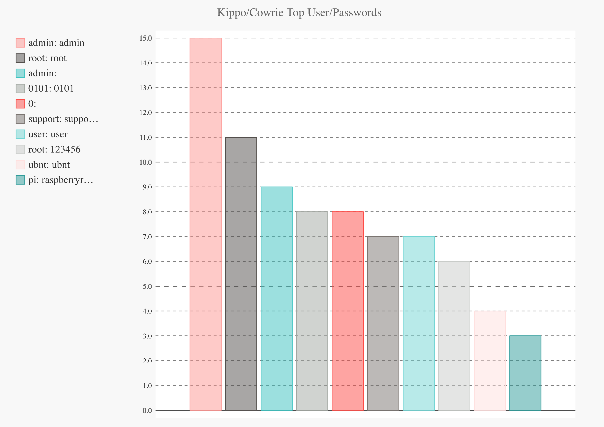
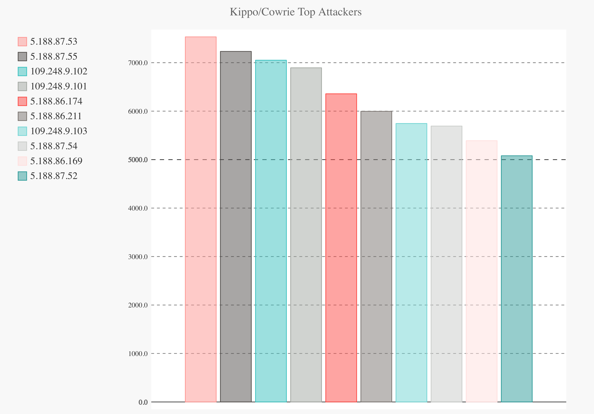
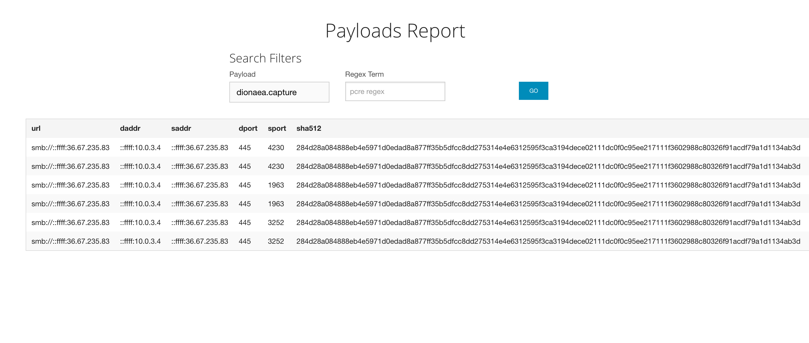
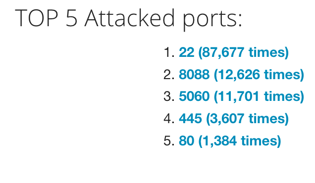
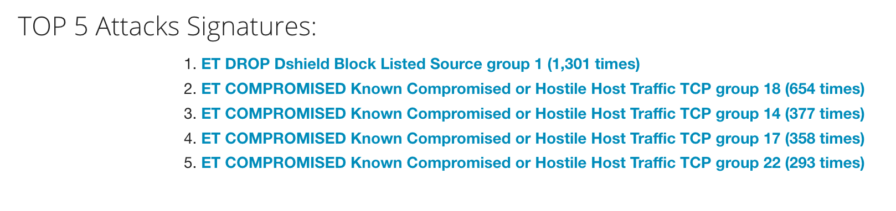
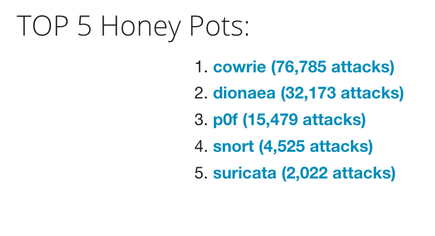

#  Project 8 - Pentesting Live Targets 

> Objective: Setting up honeypot network to observe attack patterns and collect information about exploitation of vulnerable systems. 

## Deployed Honeypots
>Total of 23 pots
- 9 Cowrie
- 6 Dionaea
- 2 Snort
- 2 Shockpot
- 1 Conpot
- 1 p0f
- 1 Suricata
- 1 ElasticHoney

## Data Summary
The honeypot Cowrie logged and reported data, as seen below: 

Dionaea provided malware snippets:

MHN provides statistics. 
Here are some:

## Questions

There is so much data, it definitely warrants further investigations. An obvious inquiry would be: how many IP addresses are recurring?

I did not include screenshots regarding which country attacks originated from. I used a VPN when scanning these; I would expect no less of someone who is actually attempting to exploit.

Microsoft Azure is hosting my honeypots; their student program offers free hosting. I look forward to observing attack trends for the next several months.
